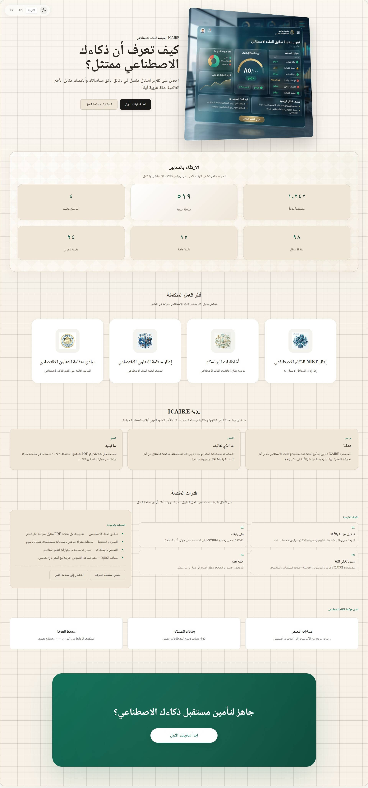
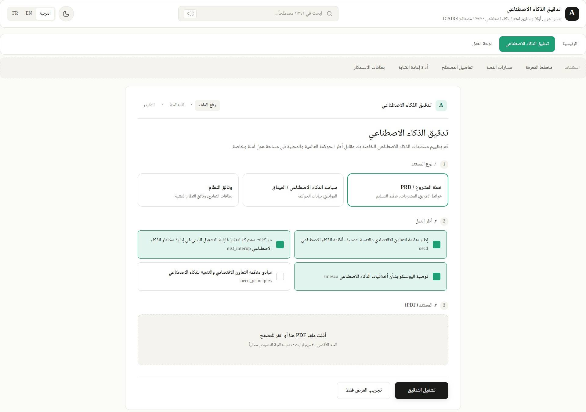
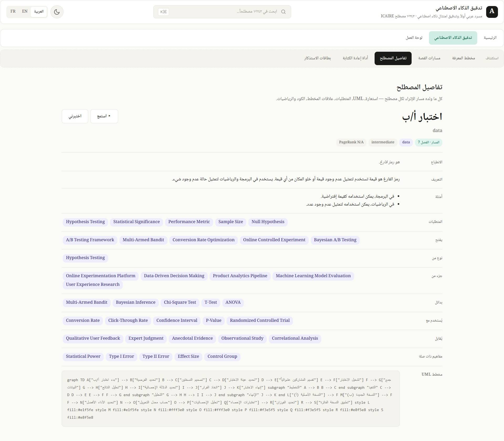
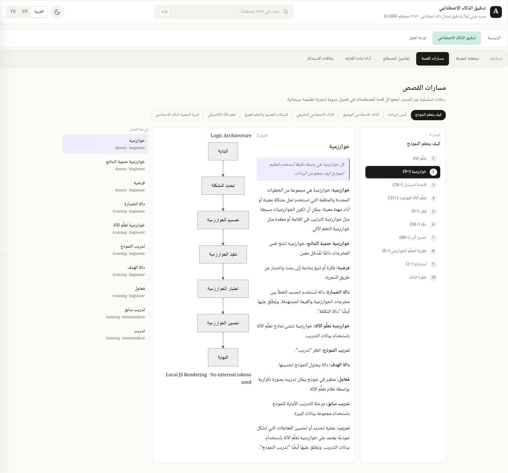
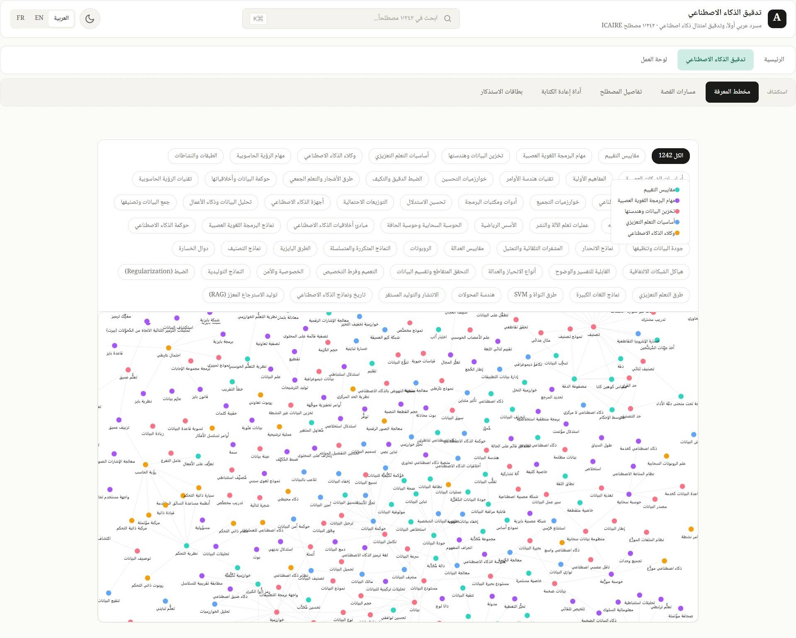
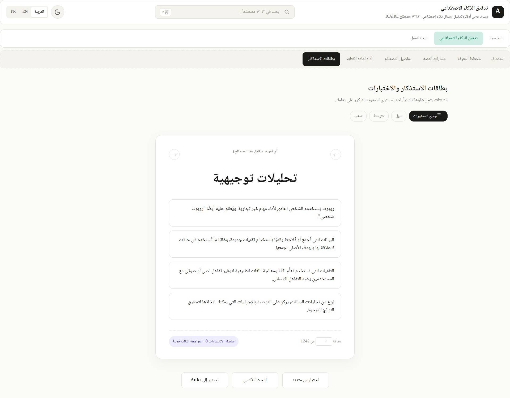
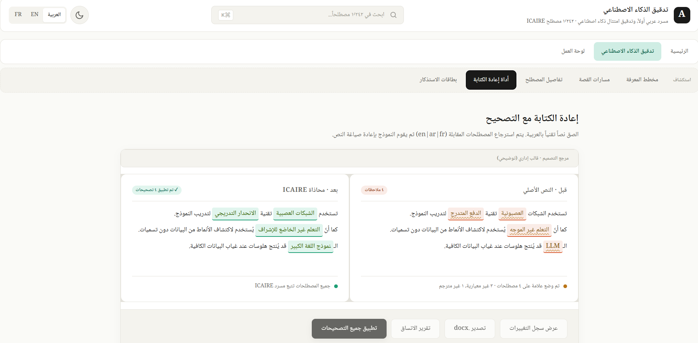

 


 
# AI-Audit: Arabic-First AI Compliance Auditor & ICAIRE Glossary Living Platform

[](https://huggingface.co/collections/FatimahEmadEldin/ai-audit)
[](https://www.kaggle.com/competitions/ai-context-challenge-by-icaire/writeups/AI-Audit)
[]([https://github.com/astral-fate/Tashkees-AI-at-AbjadMed](https://github.com/astral-fate/term_graph))
[](https://term-graph.pages.dev/)
[](https://creativecommons.org/licenses/by/4.0/)

AI-Audit transforms static AI governance vocabularies into an interactive, multi-layered learning platform and a deployment-ready compliance enforcement tool. Built for the **AI Glossary Challenge by ICAIRE** under **UNESCO patronage** in partnership with **BEYOND Academy**, this system ensures that Arabic-speaking institutions can audit localized AI documentation against international benchmarks using unified, canonical terminology.


 

## 🖥️ Platform Interface Previews & Gallery

Explore the interactive live workspace features of the AI-Audit platform across core pedagogical and evaluation modules:

<table width="100%">
  <tr>
    <td width="50%" valign="top" align="center">
      <h4>Bilingual Home Interface (Arabic Native RTL)</h4>
      
      <p style="font-size: 13px; color: #888; margin-top: 8px;">The default localized RTL user landing workspace establishing immediate access to vocabulary, audit engines, and curriculum tracking.</p>
    </td>
    <td width="50%" valign="top" align="center">
      <h4>Bilingual Home Interface (English LTR)</h4>
      
      <p style="font-size: 13px; color: #888; margin-top: 8px;">Seamless, on-the-fly cross-lingual directional toggle layout maintaining layout structure integrity across dynamic locale states.</p>
    </td>
  </tr>

  <tr>
    <td width="50%" valign="top" align="center">
      <h4>Phase 2 Live Production Compliance Auditor</h4>
      
      <p style="font-size: 13px; color: #888; margin-top: 8px;">Active governance evaluation pane mapping document segments against 519 targets to issue zero-drift canonical Arabic remediations.</p>
    </td>
    <td width="50%" valign="top" align="center">
      <h4>Bilingual Term Matrix Side-Drawer Panel</h4>
      
      <p style="font-size: 13px; color: #888; margin-top: 8px;">Contextual side-drawer showcasing parallel bilingual definitions, misconception profiles, difficulty tiers, and interactive charts.</p>
    </td>
  </tr>

  <tr>
    <td width="50%" valign="top" align="center">
      <h4>Pedagogical Story Tracks & Curriculums</h4>
      
      <p style="font-size: 13px; color: #888; margin-top: 8px;">Visual guide routing terms through 7 thematic series tracks (e.g., Trustworthy AI) to breakdown structural learning dependencies.</p>
    </td>
    <td width="50%" valign="top" align="center">
      <h4>8,400+ Edge Interactive Knowledge Graph</h4>
      
      <p style="font-size: 13px; color: #888; margin-top: 8px;">Interactive semantic relationship layout mapped using localized community split logic and multi-layered importance profiling.</p>
    </td>
  </tr>

  <tr>
    <td width="50%" valign="top" align="center">
      <h4>Gamified Reinforcement Flashcard Engine</h4>
      
      <p style="font-size: 13px; color: #888; margin-top: 8px;">Interactive reinforcement assessment module generating contextual question fields and target-calibrated misconceptions.</p>
    </td>
    <td width="50%" valign="top" align="center">
      <h4>Bilingual Document Context Rewriter</h4>
      
      <p style="font-size: 13px; color: #888; margin-top: 8px;">A native document editing sandbox allowing users to replace mismatched phrasing with approved canonical text blocks in real-time.</p>
    </td>
  </tr>
</table>

 
 

## The Problem

 


The ICAIRE AI Glossary publishes 1,242 carefully curated Arabic + English + French AI terms. As a static reference it solves a real problem — having canonical translations exists.

But as a static reference it cannot solve the problems Arabic-speaking institutions adopting AI actually have today:

* **Ministries** drafting AI procurement specs that miss EU AI Act high-risk obligations.
* **Universities** deploying AI tools without fundamental rights impact assessments.
* **Arabic AI documentation** written with three different non-canonical terms for "neural network" in the same paragraph.
* **Students** who can find a definition for "Transformer" but no path through the field that would tell them when, why, and how to learn it.

AI-Audit turns the static glossary into both a learning platform and a working compliance instrument.

---

## The Proposed Solution


What I built — two integrated halves on one enriched dataset:

1. **Half 1:** Enriched ICAIRE glossary + Living Learning Platform
2. **Half 2:** The Compliance Auditor

I extended the ICAIRE glossary's 2-sentence-per-term reference into a structured knowledge artifact, then built an interactive platform on top of it.

### Half 1: Enriched ICAIRE Glossary & Living Learning Platform

#### The Enrichment Pipeline


The enrichment pipeline (Colab + Qwen 2.5-7B-Instruct in 4-bit, idempotent + resumable, runs across all 1,242 terms) operates across several layers:

* **Layer 0 — Bootstrap:** Per-term folder structure created from the source CSV.
* **Layer 1 — Bilingual Enrichment:** For each term: AR + EN one-sentence "feel" hook, 3-4 sentence detailed explanation in parallel AR + EN, difficulty grade (beginner / intermediate / advanced / research), fine-grained cluster (50+ data-grounded categories from EDA), three flashcard distractors, common misconceptions.
* **Layer 2 — Story-Track Assignment:** Each term placed into 0..n of 7 narrative tracks: *Data Foundations, How a Model Learns, Neural Networks & Deep Learning, Classical ML & Statistics, Applied AI, Trustworthy AI, AI Infrastructure*. This includes a chapter hint, role (foundational / supporting / advanced), position-in-track, and narrator-voice hook in both languages.
* **Layer 3 — Graph Extraction:** Typed relationship edges per term: prerequisites, unlocks, is-a, part-of, contrasts-with, used-with, alternative-to.
* **Layer 4 — Resolve + Analyze:** Edges fuzzy-matched to actual term names (rapidfuzz), PageRank computed across the resulting directed graph, and Louvain community detection over the graph.
* **Layer 5 — Mermaid UML Diagrams:** A separate pipeline generated per-term flowchart diagrams (graph TD, Arabic node labels) packaged as `visual.js` modules.
* **Layer 6 — Exports:** Six formats: `glossary_enriched.json` master file, `graph.json` for D3/vis-network, `story_map.json` chapter-organized per track, `graph.gexf` for Gephi, `graph.cypher` for Neo4j, `glossary.tbx` for CAT tools, plus an `icaire_glossary.apkg` Anki deck.

> **Summary:** The pipeline took the ICAIRE glossary from 2 sentences per term to 12+ structured fields per term, with typed graph edges between terms, a 7-track story scaffold, per-term Mermaid UML diagrams, and portable exports for downstream tools.

#### The Learning Hub

Built on this enriched data, the Learning Hub features:

* A **1,242-node interactive knowledge graph**, color-coded by Louvain cluster, sized by PageRank, filterable by track and difficulty.
* **Seven scrollytelling story tracks** where terms are introduced in narrator voice within each track's chapter arc.
* A figure-based **Transformer Anatomy explorer** where clickable hotspots on a stylized SVG architecture surface the relevant term card (definition, mermaid diagram, prerequisites, related terms).
* **Term-detail pages** exposing every enrichment field — bilingual definition, metaphor, cluster, difficulty, prerequisites, unlocks, mermaid UML, story-track context.
* **Auto-generated flashcards** in four modes (multiple-choice, cloze, reverse lookup, pair matching) with the distractors from Layer 1.

---

### Half 2: The Compliance Auditor


A separate platform module where a user uploads AI documentation (project plan, AI policy, system / model card, procurement RFP) in PDF, DOCX, or Markdown, selects which governance frameworks to audit against, and receives a control-by-control compliance report.

For every control in every selected framework, the auditor returns:

* Status (met / partial / not met / N/A)
* Confidence score
* Exact evidence span from the user's document
* Plain-English reasoning
* Suggested remediation written in canonical ICAIRE Arabic and English vocabulary that the user can paste back into their document
* Clickable related ICAIRE glossary terms

#### Product Integration: How the Two Halves Connect

* Every governance term that appears anywhere in the auditor's output is a clickable `<TermLink>`.
* On click, it opens a side drawer showing the term's ICAIRE definition, mermaid diagram, mini knowledge-graph neighborhood, and a button to dive into the full Learning Hub.
* The Learning Hub preserves audit context — when the user has finished exploring a term, a "Return to audit" pill takes them back to where they were.

> **The Ecosystem Core:** The auditor is the utility surface. The Learning Hub is the explainability surface. The enriched glossary is the shared substrate. The same `term_id` references resolve in both halves. That's not decoration — it's why the platform makes sense as one product instead of two.

---

### How the Auditor Works

The system runs in two phases, both grounded in the enriched glossary.


#### Phase 1 — Indexing (Offline, done once)

Built a structured rubric from raw governance PDFs:

1. Source PDFs (*UNESCO Recommendation on the Ethics of AI, OECD Framework for the Classification of AI Systems, OECD AI Principles, NIST common interoperability guideposts*) parsed page-by-page with `pypdf`.
2. Cleaned text chunked into ~12,000-character windows with 1,500-character overlap.
3. Each chunk passed to Qwen3-Next-80B via NVIDIA NIM with a structured-extraction prompt that returns a JSON record per control: title, verbatim text, plain-English intent, evidence-of-compliance signals, evidence-of-non-compliance anti-signals, severity, weight, applicable document types, remediation template, source page numbers.
4. Records normalized, validated, deduplicated by content hash.
5. Each control linked to its top-K most semantically relevant ICAIRE glossary terms via BGE-M3 embeddings (cosine similarity $\ge 0.45$).
6. Concurrent extraction (8-way ThreadPoolExecutor against NIM) brought UNESCO extraction time from 100 minutes sequential down to ~13 minutes parallel.

**Result:** 519 structured controls across 4 frameworks, each linked into the enriched 1,242-term ICAIRE glossary via 1024-dimensional multilingual embeddings.

#### Phase 2 — Audit Runtime (Online, per-user)

1. The user's document is parsed and chunked using the same logic.
2. Document chunks are embedded with the same BGE-M3 model (in-memory, discarded after the audit).
3. For every control in the selected frameworks, the auditor retrieves the user's top-3 most relevant chunks by cosine similarity.
4. The retrieved chunks plus the control's `intent_summary`, `evidence_signals`, and `anti_signals` are sent to the LLM in a focused per-control prompt: *"evaluate, score, cite evidence, suggest remediation in canonical ICAIRE terminology."*
5. Per-control results aggregate into the dashboard, gap list, and exportable PDF / JSON / CSV report.

Because Phase 1 already pre-digested each framework into a rubric with explicit signals, Phase 2's prompts are short, grounded, and audits run in seconds with consistent answers.

---

 

### Practicality and Utility

* The compliance auditor is a deployable web tool a real user runs against a real document and gets actionable output today.
* The Learning Hub is a daily-use educational surface for the same vocabulary the auditor enforces.
* Neither half is a research demo.

### Research-Driven Outcomes

Multiple reusable artifacts: the enriched glossary dataset (1,242 terms × 12+ fields, typed graph, story tracks, mermaid diagrams), the framework rubric dataset (519 controls × bilingual ICAIRE links), pre-computed BGE-M3 embeddings, and exports in formats that downstream researchers can pick up directly (Gephi, Neo4j, CAT tools, Anki).

### Cultural Accuracy

* The platform is Arabic-first and bilingual end-to-end with full RTL support.
* Every flag, score, and remediation uses canonical ICAIRE Arabic vocabulary by construction.
* Story tracks include a dedicated *Trustworthy AI* track that surfaces ethics terms and their cultural dimensions.

### Technical Impact

* The framework $\leftrightarrow$ ICAIRE bridge is reusable infrastructure no one had published before.
* The enriched glossary alone is a publishable contribution to Arabic NLP and AI education research, independent of the auditor.
* **Alignment with ICAIRE Standards:** The ICAIRE glossary is the lexical layer through which the entire system communicates. The auditor cannot generate a remediation that uses non-canonical terminology, by construction. The Learning Hub is built on enrichment of the ICAIRE glossary, not a substitute for it — every term card cites the canonical ICAIRE entry.

---

## Value Proposition per Audience


* **Ministries and Government Entities:** Verify your AI procurement specs and citizen-service AI plans satisfy EU AI Act, NIST, OECD, and UNESCO obligations before you ship. The audit-grade PDF attaches to internal review packets. Vision 2030 procurement is the textbook use case.
* **Universities and Research Institutions:** Audit AI ethics review packets and grant proposals. Use the Learning Hub to teach the vocabulary as students encounter it in the audit. The Anki deck is a self-contained study artifact.
* **Independent Researchers, Translators, Journalists:** The enriched ICAIRE glossary is a free, structured, bilingual reference with story-track scaffolding for self-paced learning.
* **Open-Source Developers:** Both Hugging Face datasets are CC-BY-licensed. The framework $\leftrightarrow$ ICAIRE bridge is the first publicly available bilingual AI-governance ontology. The Cypher and GEXF exports drop straight into Neo4j or Gephi.
* **ICAIRE Itself:** The enriched glossary is a deployment vector for ICAIRE's vocabulary — the canonical terms now travel into the workflows where Arabic AI content is actually produced and reviewed, instead of staying in a static reference site.

---

## Tech Stack


* **Frontend:** Next.js 15 (App Router), TypeScript, Tailwind, shadcn/ui, next-intl for English+Arabic with RTL support.
* **Audit Backend:** Python, FastAPI, deployed on Hugging Face Spaces (CPU).
* **Indexing Pipeline:** Colab notebook orchestrating PDF parsing, chunking, concurrent LLM calls (8-way ThreadPoolExecutor), idempotent per-chunk caching to Google Drive.
* **Glossary Enrichment Pipeline:** Colab notebook running Qwen 2.5-7B-Instruct in 4-bit (`bitsandbytes nf4`) locally on a T4 GPU, fully resumable, atomic writes per term.
* **LLMs:** * Qwen 2.5-7B-Instruct (local 4-bit, glossary enrichment + per-term Mermaid generation).
* Qwen3-Next-80B-A3B-Instruct via NVIDIA NIM (framework extraction + per-control audit evaluation).


* **Embeddings:** BAAI/bge-m3 (1024-dim, multilingual, normalized).
* **Graph Analysis:** NetworkX, python-louvain, rapidfuzz for fuzzy edge resolution.
* **Visualization:** D3 / vis-network for the knowledge graph, Mermaid for per-term UML, `matplotlib` + `arabic-reshaper` + `python-bidi` for EDA plots.
* **Document Parsing:** `pypdf`, `python-docx`.
* **Storage:** Hugging Face Hub for datasets, browser `localStorage` for audit history, no external database required.
* **Design System:** Flat, two type weights (400 / 500), 0.5px borders, no gradients, dark-mode native, RTL-first; Tabler outline icons only.

---

## Honest Limitations

* LLM-generated enrichment fields (hooks, distractors, intent summaries, signals, remediation) were spot-checked but not exhaustively reviewed. A v2 release with full human review of high-severity controls and high-PageRank glossary terms is the immediate next step.
* The framework $\leftrightarrow$ ICAIRE matching uses embedding similarity only. For highest-stakes controls, an LLM filter pass on top-K candidates would improve precision (an acceptable trade-off for hackathon scope).
* Current framework coverage is UNESCO, OECD Framework, OECD AI Principles, and NIST interoperability guideposts. SDAIA, EU AI Act full text, NIST AI RMF 1.0 core, and ISO/IEC 42001 are scoped for the next release — the indexing pipeline accepts them with a single config-line addition.
* Audit results are an LLM-assisted research aid for human compliance reviewers, not legal advice. The platform displays this disclosure on every report.

---

## Numbers at a Glance

| Metric | Count / Detail |
| --- | --- |
| **Enriched Glossary Terms** | 1,242 ICAIRE terms enriched |
| **Structured Fields** | 12+ per term |
| **Story Tracks** | 7 tracks covering ~1,140 terms |
| **UML Diagrams** | ~1,180 auto-generated Mermaid diagrams |
| **Graph Edges** | ~8,400 typed edges (*prerequisites, unlocks, is-a, etc.*) |
| **Governance Controls** | 519 extracted across 4 frameworks |
| **Embeddings** | 1024-dim BGE-M3 precomputed for both corpora |
| **Export Formats** | 6 formats (*master JSON, graph JSON, story map, GEXF, Cypher, TBX, Anki*) |
| **Published Datasets** | 3 Hugging Face datasets published (*rubric, embedded, enriched glossary*) |

---

## Project Links

* **Live Demo (Web Platform):** [https://term-graph.pages.dev/](https://term-graph.pages.dev/)
* **GitHub Repository (Full Source):** [https://github.com/astral-fate/term_graph](https://github.com/astral-fate/term_graph)
* **Hugging Face Dataset (Frameworks Raw Rubric):** [https://huggingface.co/datasets/FatimahEmadEldin/AI-Audit-frameworks-raw](https://huggingface.co/datasets/FatimahEmadEldin/AI-Audit-frameworks-raw)
* **Hugging Face Dataset (Frameworks Embedded):** [https://huggingface.co/datasets/FatimahEmadEldin/AI-Audit-frameworks-embedded](https://huggingface.co/datasets/FatimahEmadEldin/AI-Audit-frameworks-embedded)
* **Hugging Face Dataset (Enriched ICAIRE Glossary):** [https://huggingface.co/datasets/FatimahEmadEldin/icaire-ai-glossary-enriched](https://huggingface.co/datasets/FatimahEmadEldin/icaire-ai-glossary-enriched)
* **Hugging Face Space (Audit Backend):** [https://huggingface.co/spaces/FatimahEmadEldin/AI-Audit](https://www.google.com/search?q=https://huggingface.co/spaces/FatimahEmadEldin/AI-Audit)

---

## Citation

```bibtex
@software{AI-Audit_2026,
 author = {Emad Eldin, Fatimah Mohammad},
 title = {AI-Audit: Arabic-First AI Compliance Auditor and ICAIRE Glossary Living Platform},
 year = {2026},
 publisher = {AI Glossary Challenge by ICAIRE under UNESCO patronage},
 url = {https://github.com/astral-fate/term_graph}
}

@dataset{AI-Audit_glossary_enriched_2026,
 author = {Emad Eldin, Fatimah Mohammad},
 title = {Enriched ICAIRE Glossary: bilingual hooks, story tracks, typed graph edges, and Mermaid UML for 1,242 terms},
 year = {2026},
 publisher = {Hugging Face},
 url = {https://huggingface.co/datasets/FatimahEmadEldin/icaire-ai-glossary-enriched}
}

@dataset{AI-Audit_frameworks_raw_2026,
 author = {Emad Eldin, Fatimah Mohammad},
 title = {AI-Audit Frameworks: ICAIRE-Grounded AI Governance Rubric},
 year = {2026},
 publisher = {Hugging Face},
 url = {https://huggingface.co/datasets/FatimahEmadEldin/AI-Audit-frameworks-raw}
}

```

---

## Acknowledgements

Built for the AI Glossary Challenge by ICAIRE under UNESCO patronage in partnership with BEYOND Academy. Grounded in the ICAIRE AI Glossary (thakai.icaire.org/glossaries).

Source frameworks: UNESCO Recommendation on the Ethics of AI, OECD Framework for the Classification of AI Systems and OECD AI Principles, NIST common interoperability guideposts.

LLM inference: Qwen models via NVIDIA NIM (cloud) and Hugging Face Transformers (local 4-bit). Embedding model: BAAI BGE-M3.
